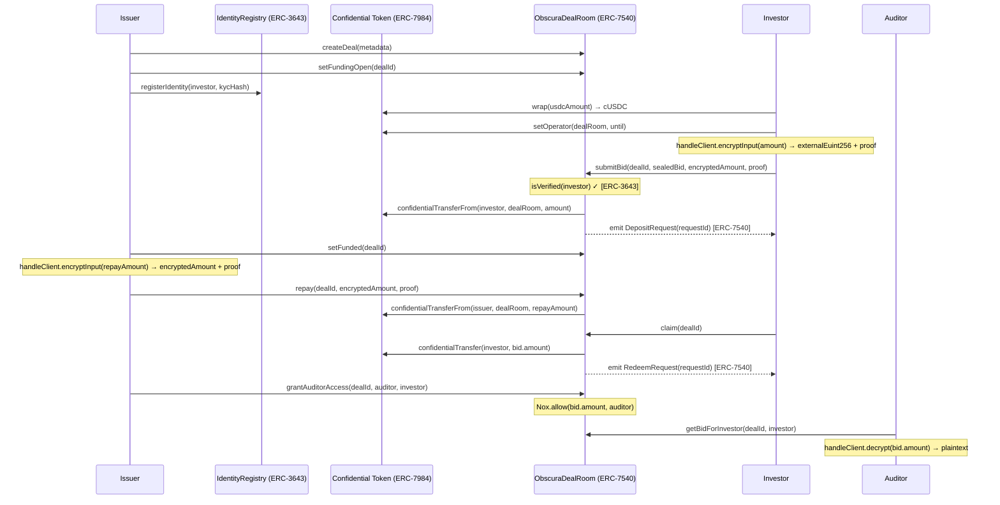

# Obscura Finance — Architecture

## Table of Contents
1. [System Overview](#1-system-overview)
2. [Layer Breakdown](#2-layer-breakdown)
3. [Smart Contract Architecture](#3-smart-contract-architecture)
4. [ERC Standard Integration](#4-erc-standard-integration)
5. [Deal State Machine](#5-deal-state-machine)
6. [Full Protocol Sequence](#6-full-protocol-sequence)
7. [Encryption & Privacy Model](#7-encryption--privacy-model)
8. [Frontend Architecture](#8-frontend-architecture)
9. [Directory Structure](#9-directory-structure)
10. [Security Properties](#10-security-properties)

---

## 1. System Overview

Obscura Finance is a three-layer system: an **on-chain protocol** (smart contracts), an **off-chain encryption layer** (iExec Nox TEE), and a **Next.js dApp** that wires them together.

```
┌──────────────────────────────────────────────────────────────────┐
│                        BROWSER (dApp)                           │
│  ┌──────────────┐  ┌──────────────┐  ┌──────────────────────┐  │
│  │  Issuer UI   │  │ Investor UI  │  │     Auditor UI        │  │
│  └──────┬───────┘  └──────┬───────┘  └──────────┬───────────┘  │
│         │                 │                       │              │
│  ┌──────▼─────────────────▼───────────────────────▼───────────┐ │
│  │              wagmi + viem (EVM hooks)                       │ │
│  └──────────────────────────┬────────────────────────────────┘ │
│                             │                                    │
│  ┌──────────────────────────▼────────────────────────────────┐ │
│  │           @iexec-nox/handle  (client-side TEE)             │ │
│  │     encrypt(amount) → externalEuint256 + inputProof        │ │
│  └──────────────────────────┬────────────────────────────────┘ │
└─────────────────────────────┼────────────────────────────────────┘
                              │  RPC (Arbitrum Sepolia)
┌─────────────────────────────▼────────────────────────────────────┐
│                     ON-CHAIN (Arbitrum Sepolia)                   │
│                                                                   │
│  ┌────────────────────┐    ┌────────────────────────────────┐    │
│  │  IdentityRegistry  │    │      ObscuraDealRoom           │    │
│  │  (ERC-3643)        │◄───│  (ERC-7540 + ERC-3643 gate)   │    │
│  └────────────────────┘    └──────────────┬─────────────────┘    │
│                                           │                       │
│                            ┌──────────────▼─────────────────┐    │
│                            │   Confidential Token (ERC-7984) │    │
│                            │   euint256 handles — Nox TEE    │    │
│                            └────────────────────────────────┘    │
└──────────────────────────────────────────────────────────────────┘
```

---

## 2. Layer Breakdown

| Layer | Technology | Role |
|---|---|---|
| **Interface** | Next.js 14, TypeScript, Tailwind, wagmi | User-facing dApp for all four roles |
| **Encryption** | iExec Nox Handle (`@iexec-nox/handle`) | Client-side TEE encryption; produces `externalEuint256` + `inputProof` |
| **Compliance** | `IdentityRegistry.sol` (ERC-3643) | KYC whitelist; gating bid submission |
| **Deal logic** | `ObscuraDealRoom.sol` (ERC-7540) | Sealed bid lifecycle, repayment, claim |
| **Confidential token** | ERC-7984 cUSDC (iExec Nox) | Hidden balances, confidential transfers |
| **Settlement** | Arbitrum Sepolia | EVM execution environment |

---

## 3. Smart Contract Architecture

### Contract graph

```
contracts/
├── interfaces/
│   └── IERC3643.sol          ← IIdentityRegistry + ICompliance
├── IdentityRegistry.sol      ← ERC-3643 KYC registry
└── ObscuraDealRoom.sol       ← core deal room (imports both above + IERC7984)
```

```
┌──────────────────────────────────────────────────────┐
│                  ObscuraDealRoom                      │
│                                                       │
│  immutable: IERC7984 confidentialToken               │
│  immutable: IIdentityRegistry identityRegistry        │
│                                                       │
│  Deal[]  deals                                        │
│  mapping dealId → investor → Bid                      │
│  mapping dealId → auditor  → bool                     │
│  mapping requestId → controller → pendingDeposit      │
└───────────────┬──────────────────────┬────────────────┘
                │                      │
   ┌────────────▼──────────┐  ┌────────▼──────────────┐
   │   IdentityRegistry    │  │  Confidential Token    │
   │   (ERC-3643)          │  │  (ERC-7984 — external) │
   │                       │  │                        │
   │  admin: address       │  │  confidentialTransfer  │
   │  _identities: map     │  │  confidentialTransferFrom│
   │  registerIdentity()   │  │  setOperator()         │
   │  revokeIdentity()     │  │  confidentialBalanceOf │
   │  isVerified()         │  └────────────────────────┘
   └───────────────────────┘
```

### Key data structures

```solidity
struct Deal {
    address issuer;
    DealMetadata metadata;   // title, category, maturityDate, description, documentHash
    DealState state;         // Open | Funding | Funded | Repaid | Claimed
    euint256 totalCommitted; // encrypted — never plaintext
    euint256 totalRepaid;
    euint256 totalClaimed;
}

struct Bid {
    bytes32  sealedBid;      // hash of offchain terms (commitment)
    euint256 amount;         // encrypted handle — never plaintext
    bool     claimed;
    uint256  requestId;      // ERC-7540 request identifier
}
```

### Access control matrix

| Function | Who can call | Guard |
|---|---|---|
| `createDeal` | Anyone | — |
| `setFundingOpen` / `setFunded` / `closeDeal` | Issuer only | `onlyIssuer` |
| `submitBid` | ERC-3643 verified investors | `isVerified(msg.sender)` + deal in `Funding` state |
| `repay` | Issuer only | `onlyIssuer` + deal in `Funded` state |
| `claim` | Investor who bid | `!bid.claimed` + deal in `Repaid`/`Claimed` |
| `grantAuditorAccess` | Issuer only | `onlyIssuer` |
| `getBidForInvestor` | Investor, issuer, or authorized auditor | three-way `require` |
| `registerIdentity` / `revokeIdentity` | Registry admin | `onlyAdmin` |

---

## 4. ERC Standard Integration

### ERC-7984 — Confidential Token

iExec's confidential ERC-20 wrapper. All amounts in Obscura are `euint256` handles — opaque ciphertexts processed inside Nox TEEs.

```
User wraps USDC → ERC-7984 cUSDC (balance hidden)
         │
         ▼
  setOperator(dealRoom, until)    ← authorize deal room to pull funds
         │
         ▼
  submitBid → confidentialTransferFrom(investor, dealRoom, euint256)
         │
         ▼  Nox.allow(handle, investor)  ← investor retains read access
  Bid.amount stored as euint256 in contract state
```

Key invariant: **plaintext amounts are never stored, emitted in events, or returned in view functions.**

---

### ERC-3643 — Identity & Compliance (T-REX)

KYC/AML gate enforced at the smart contract level.

```
Admin (issuer/platform)
  │
  ├── registerIdentity(investor, kycHash)   ← kycHash = hash of offchain KYC doc
  │
  └── revokeIdentity(investor)              ← sanctions hit, expired KYC

ObscuraDealRoom.submitBid:
  require(identityRegistry.isVerified(msg.sender))  ← hard gate
```

`ICompliance` interface is defined for future transfer-level compliance hooks (e.g., jurisdiction limits, investor caps).

---

### ERC-7540 — Async Vault

The sealed bid lifecycle maps naturally to the ERC-7540 async deposit/redeem pattern.

| ERC-7540 concept | Obscura mapping |
|---|---|
| `requestDeposit(assets, controller, owner)` | `submitBid(dealId, sealedBid, encryptedAmount, proof)` |
| `DepositRequest` event | emitted in `submitBid`; `assets = 0` (confidential) |
| `pendingDepositRequest(requestId, controller)` | returns 0 (amount is a confidential handle) |
| `claimableDepositRequest` | returns 0 (use `getBidForInvestor` for the encrypted handle) |
| `RedeemRequest` event | emitted in `claim` |

`assets = 0` in events is intentional and documented: the amount is stored as an `euint256` handle accessible only to authorized parties via `getBidForInvestor`.

---

## 5. Deal State Machine

```
         createDeal()
              │
              ▼
          ┌───────┐
          │  Open │
          └───┬───┘
              │ setFundingOpen()
              ▼
         ┌─────────┐    submitBid() × N
         │ Funding │◄──────────────────── Investors
         └────┬────┘
              │ setFunded()
              ▼
          ┌────────┐
          │ Funded │
          └────┬───┘
               │ repay()
               ▼
          ┌────────┐
          │ Repaid │◄──── claim() × N (investors)
          └────┬───┘
               │ closeDeal()
               ▼
          ┌─────────┐
          │ Claimed │
          └─────────┘
```

State transitions are **issuer-controlled** except `claim` (any investor with a bid).

---

## 6. Full Protocol Sequence



---

## 7. Encryption & Privacy Model

### Who can see what

| Data | Investor | Issuer | Auditor | Public |
|---|---|---|---|---|
| Deal metadata (title, category) | ✅ | ✅ | ✅ | ✅ |
| Bid amount | ✅ (own) | ❌ | ✅ (if granted) | ❌ |
| Total committed | ❌ | ❌ | ❌ | ❌ |
| Repayment amount | ❌ | ✅ | ✅ (if granted) | ❌ |
| Claim amount | ✅ (own) | ❌ | ✅ (if granted) | ❌ |

### Nox Handle encryption flow

```
Client side (browser)
  handleClient = createViemHandleClient(walletClient)
  { externalEuint256, inputProof } = await handleClient.encryptInput(amount)
        │
        │  sent to contract as calldata
        ▼
Contract side (EVM)
  euint256 handle = Nox.fromExternal(externalEuint256, inputProof)
  Nox.allow(handle, msg.sender)       ← ACL: investor can read own bid
  Nox.allow(handle, address(token))   ← ACL: token contract can transfer
  stored as euint256 in contract state
        │
        │  Nox.allow(handle, auditor) on grantAuditorAccess
        ▼
Auditor client
  handleClient.decrypt(bid.amount) → plaintext amount
```

---

## 8. Frontend Architecture

```
src/
├── app/
│   ├── page.tsx              ← Landing page
│   ├── issuer/page.tsx       ← Issuer dashboard (create, fund, repay, grant)
│   ├── investor/page.tsx     ← Investor dashboard (wrap, bid, claim) + IdentityStatus
│   ├── auditor/page.tsx      ← Auditor lookup (permissioned disclosure)
│   └── demo/page.tsx         ← Guided demo walkthrough
│
├── components/
│   ├── deals/
│   │   ├── bid-form.tsx          ← Nox encrypt → submitBid
│   │   ├── repay-form.tsx        ← Nox encrypt → repay
│   │   ├── claim-button.tsx      ← claim()
│   │   ├── create-deal-form.tsx  ← createDeal()
│   │   ├── deal-list.tsx         ← read deals, per-role actions
│   │   ├── deal-state.tsx        ← state badge
│   │   ├── encrypted-amount.tsx  ← show euint256 handle (obfuscated)
│   │   ├── grant-auditor.tsx     ← grantAuditorAccess()
│   │   ├── audit-lookup.tsx      ← getBidForInvestor() + decrypt
│   │   ├── identity-status.tsx   ← ERC-3643 isVerified badge
│   │   ├── token-balance.tsx     ← confidentialBalanceOf
│   │   ├── wrap-form.tsx         ← wrap ERC-20 → ERC-7984
│   │   └── wrap-instructions.tsx ← setOperator guide
│   ├── ui/                       ← Card, Button, Input, Badge, Label
│   ├── effects/ColorBends.tsx    ← Three.js background
│   ├── nav.tsx
│   ├── providers.tsx             ← wagmi + QueryClient
│   ├── section-heading.tsx
│   ├── tx/tx-link.tsx            ← Arbiscan explorer links
│   └── wallet-button.tsx         ← connect + chain switch (Arbitrum Sepolia)
│
└── lib/
    ├── abi.ts          ← dealRoomAbi, identityRegistryAbi, erc7984Abi, erc20Abi
    ├── contracts.ts    ← DEAL_ROOM_ADDRESS, CONFIDENTIAL_TOKEN_ADDRESS, IDENTITY_REGISTRY_ADDRESS
    ├── nox-handle.ts   ← useHandleClient() hook
    ├── explorer.ts     ← Arbiscan URL helpers
    ├── format.ts       ← number/address formatting
    ├── wagmi.ts        ← wagmi config, Arbitrum Sepolia chain
    └── utils.ts        ← clsx/twMerge
```

### Data flow in a bid submission

```
BidForm (bid-form.tsx)
  1. useHandleClient()                         ← get Nox handle client
  2. handleClient.encryptInput(amount)         ← encrypt in TEE
  3. wagmi writeContract(submitBid, args)      ← send to chain
  4. waitForTransactionReceipt                 ← confirm
  5. show TxLink(hash)                         ← Arbiscan link
```

---

## 9. Directory Structure

```
obscura-finance/
├── contracts/
│   ├── interfaces/
│   │   └── IERC3643.sol          ← IIdentityRegistry, ICompliance
│   ├── IdentityRegistry.sol      ← ERC-3643 KYC registry
│   └── ObscuraDealRoom.sol       ← core protocol (ERC-7984 + ERC-3643 + ERC-7540)
│
├── scripts/
│   └── deploy.ts                 ← deploys IdentityRegistry then ObscuraDealRoom
│
├── src/                          ← Next.js dApp (see §8)
│
├── artifacts/                    ← Hardhat compile output
├── typechain-types/              ← Generated TypeScript bindings
│
├── ARCHITECTURE.md               ← this file
├── README.md
├── feedback.md                   ← iExec tooling feedback (required deliverable)
├── hardhat.config.ts
├── next.config.mjs
├── tailwind.config.ts
└── package.json
```

---

## 10. Security Properties

| Property | Mechanism |
|---|---|
| **Amount confidentiality** | All bid/repayment amounts are `euint256` handles; never stored or emitted as plaintext |
| **Investor KYC gate** | `submitBid` reverts if `identityRegistry.isVerified(investor)` is false |
| **Access control on bid reads** | `getBidForInvestor` requires caller to be investor, issuer, or auditor granted via `Nox.allow` |
| **Operator scoping** | Investors set `setOperator(dealRoom, until)` with a time bound; operator access expires |
| **No mock data** | All onchain state is real; no hardcoded fake balances or deals |
| **Auditor isolation** | Each auditor grant is per-deal, per-investor; one issuer cannot expose all bids at once |
| **Replay protection** | `require(!Nox.isInitialized(bid.amount), "Bid exists")` — one bid per investor per deal |
| **State machine enforcement** | Each transition (submitBid, repay, claim) checks the current `DealState` |
