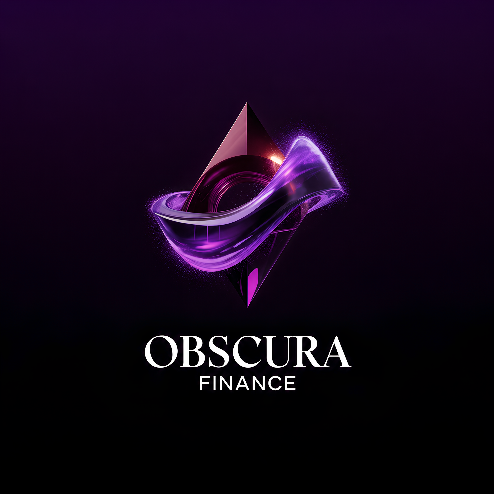
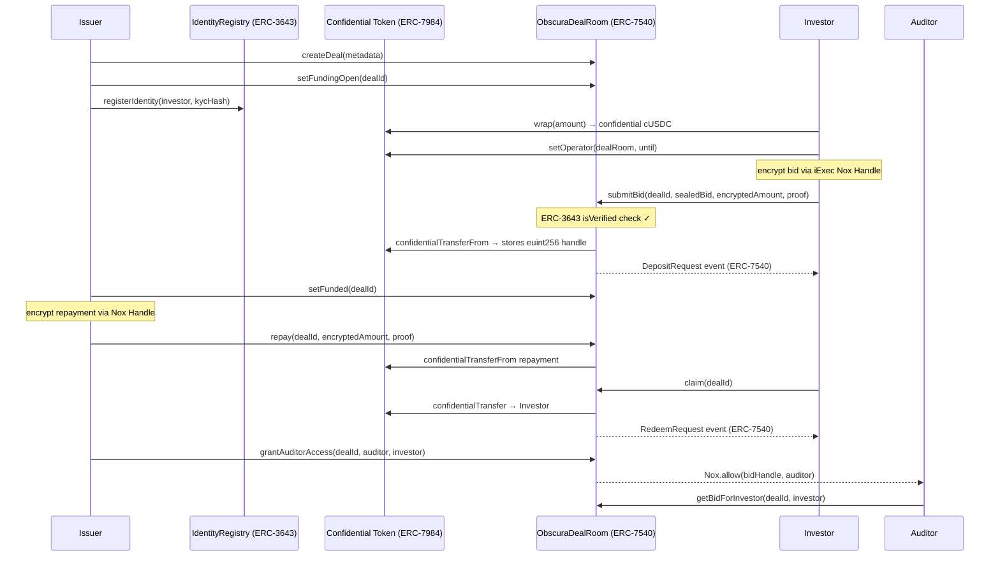

<p align="center">
	
</p>

# Obscura Finance

**Confidential RWA Deal Rooms for sealed private credit funding.**

Obscura Finance is a confidential deal room where investors submit sealed bids, allocations stay hidden, repayments settle onchain, and auditors verify details through permissioned disclosure. The MVP demonstrates a practical private credit funding flow using iExec Nox Handles and ERC-7984 Confidential Tokens.

## Who uses Obscura Finance

| Role | Problem solved |
|---|---|
| **Private credit fund managers** | Run sealed-bid allocation rounds without leaking position sizes to competitors or the market |
| **RWA issuers** (real estate, invoice, trade finance) | Accept investor commitments onchain without exposing individual allocations or deal terms publicly |
| **Institutional LPs** | Participate in tokenized debt deals without revealing portfolio exposure or investment size |
| **Compliance auditors / regulators** | Access permissioned disclosure of encrypted deal data on demand, without requiring off-chain data rooms |

The commodity Obscura produces: **verifiable, private credit commitments settled onchain** — the same workflow that today happens via emails, spreadsheets, and lawyers, executed transparently but confidentially on Arbitrum.

## Why confidential RWA funding
Private credit and RWA funding require onchain settlement, but investors cannot expose bid size, allocation, or repayment exposure publicly. Obscura Finance keeps allocations private by default and enables auditors to view sensitive details only when permissioned.

## Protocol flow



## What works end-to-end
- Issuer creates a deal with metadata (sample metadata only).
- Funding state progresses onchain: Open → Funding → Funded → Repaid → Claimed.
- Investors authorize the deal room operator and encrypt bid amounts with iExec Nox Handles.
- Bid amounts stay encrypted onchain; only the investor and authorized auditor can decrypt.
- Issuer repays onchain, investors claim repayment.
- Auditor access is permissioned onchain.
- Explorer links for every transaction.

## ERC standard compliance

### ERC-7984 — Confidential Token
Bid amounts and repayments are never stored as plaintext. `IERC7984.confidentialTransferFrom` and `confidentialTransfer` move `euint256` handles between parties. Nox operators are authorized per-transaction.

### ERC-3643 — Identity & Compliance (T-REX)
`IdentityRegistry.sol` implements `IIdentityRegistry` (ERC-3643 compliant interface). Investors must be registered with a KYC identity hash before `submitBid` is accepted. Issuers control the registry; KYC can be revoked. The `ICompliance` interface is also defined for future transfer-level compliance rules.

### ERC-7540 — Async Vault
`submitBid` maps to the ERC-7540 `requestDeposit` async pattern: each bid produces a `DepositRequest` event with a unique `requestId`. `claim` produces a `RedeemRequest` event. `pendingDepositRequest` and `claimableDepositRequest` views are implemented. Because amounts are confidential (ERC-7984), `assets` in events is `0` — the encrypted handle is accessed separately via `getBidForInvestor`.

## iExec Nox usage
- **Encrypted bids**: `BidForm` uses `@iexec-nox/handle` to encrypt amounts and send handles + proofs onchain.
- **ERC-7984 token**: `ObscuraDealRoom` uses `IERC7984` confidential transfers and operator authorization.
- **Nox types**: `euint256` handles are stored in contract state; plaintext amounts are never stored or emitted.
- **Auditor access**: issuer grants ACL access via `Nox.allow` for specific bid handles.

Key files:
- `contracts/ObscuraDealRoom.sol`
- `src/components/deals/bid-form.tsx`
- `src/components/deals/repay-form.tsx`
- `src/components/deals/encrypted-amount.tsx`
- `src/lib/nox-handle.ts`

## Tech stack
- Next.js + TypeScript + Tailwind CSS
- wagmi + viem
- Hardhat
- Arbitrum Sepolia

## Project structure
- `src/app`: UI routes (Landing, Issuer, Investor, Auditor, Demo)
- `src/components`: UI, deal actions, and wallet components
- `contracts`: Obscura deal room contract
- `scripts`: deployment scripts

## Local setup
```bash
npm install
```

Create `.env` from the example:
```bash
cp .env.example .env
```

Set:
- `NEXT_PUBLIC_RPC_URL` (optional)
- `ARB_SEPOLIA_RPC_URL`
- `DEPLOYER_PRIVATE_KEY`
- `CONFIDENTIAL_TOKEN_ADDRESS`
- `NEXT_PUBLIC_DEAL_ROOM_ADDRESS`
- `NEXT_PUBLIC_CONFIDENTIAL_TOKEN_ADDRESS`
- `NEXT_PUBLIC_IDENTITY_REGISTRY_ADDRESS`

## Compile contracts
```bash
npm run compile:contracts
```

## Deploy (Arbitrum Sepolia)
```bash
npm run deploy:arb
```

Copy the deployed deal room address into `NEXT_PUBLIC_DEAL_ROOM_ADDRESS`.

## Run the app
```bash
npm run dev
```

## Demo flow (under 4 minutes)
1. Connect wallet.
2. Ensure you have a Confidential Token on Arbitrum Sepolia.
3. Issuer creates a deal.
4. Issuer opens funding.
5. Investor authorizes operator, encrypts amount, and submits sealed bid.
6. Issuer marks the deal funded, encrypts repayment, then repays.
7. Investor claims repayment.
8. Issuer grants auditor access for a specific investor.
9. Auditor views permissioned disclosure via Auditor Lookup.

## Contract addresses
- Obscura Deal Room (Arbitrum Sepolia): see `NEXT_PUBLIC_DEAL_ROOM_ADDRESS` after deploy
- Identity Registry — ERC-3643 (Arbitrum Sepolia): see `NEXT_PUBLIC_IDENTITY_REGISTRY_ADDRESS` after deploy
- Confidential Token (ERC-7984 cUSDC, Arbitrum Sepolia): `0x1ccec6bc60db15e4055d43dc2531bb7d4e5b808e`
- Underlying USDC ERC-20 (Arbitrum Sepolia): `0x75faf114eafb1BDbe2F0316DF893fd58CE46AA4d`

## Sample metadata vs real state
- **Sample metadata only:** title, category, description, document hash.
- **Real onchain state:** deals, bids, repayments, claims, transaction hashes.

## Known limitations
- Obscura Finance requires a real ERC-7984 Confidential Token address. A mock token is intentionally not provided because the core privacy flow must be backed by real confidential token primitives.
- This MVP assumes an existing ERC-7984 Confidential Token deployment on Arbitrum Sepolia.
- Bid commitment generation is left to the investor (use a hash of offchain terms).
- Deal closure is manual (issuer closes after claims) since totals remain encrypted.

## License
MIT
